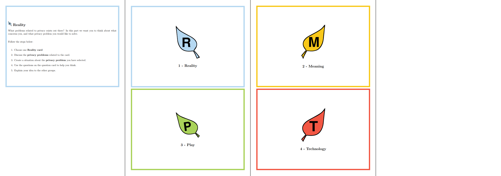
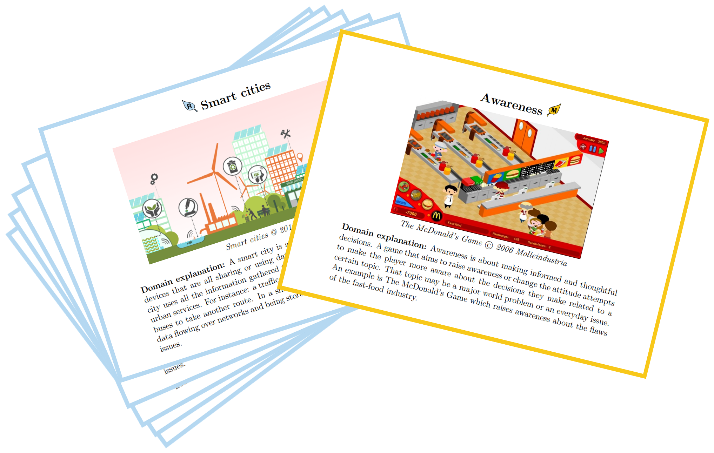
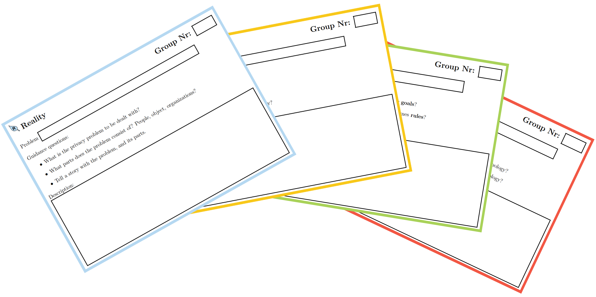

# Let's Grow Privacy Aware Together!

Serious Privacy Game Workshop (SPRIG) is a workshop that takes the participant trough developing a serious game focusing on privacy. The development of the game let the participants discuss privacy in groups in an fun and interesting way.

## Workshop Download

The workshop has 3 artifacts as well as a presentation and a guide for running the workshop.

The first is the board

[Download bord](files/board.pdf).

The second is the workshop cards
 [Download cards](files/cards.pdf).

The last part are the question cards

[Download question cards](files/question_cards.pdf)

The [presentation](files/presentation.pdf) introduces what privacy is, what personal data are, and why privacy is important.

Take a look at the [guide for running the workshop](workshop/).

## Other Activities

* [Privacy Related News Articles](news_articles/)

## Other Languages
Follow the links to see versions in other languages.

* [Norwegian]()
